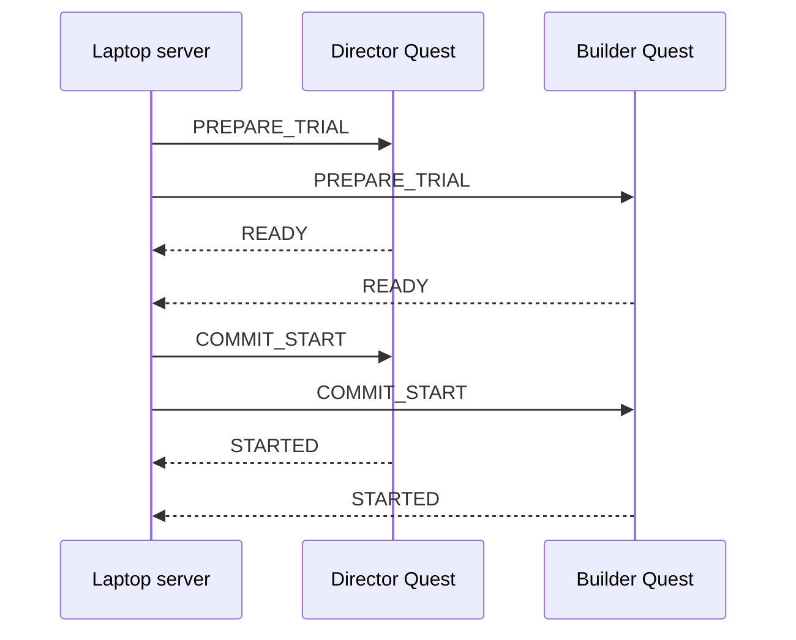

# Protocol 1.0.0

## Authority

The laptop server owns session state, trial state, state versions, and the
authoritative clock. Quests are command-driven clients. A browser refresh does
not change authoritative state.

## Compatibility

Protocol versions use `major.minor.patch`.

- The initial version is `1.0.0`.
- Peers with the same major version are compatible.
- A different major version is rejected before session commands are accepted.

## Message envelope

Every message contains:

- protocol version;
- session ID;
- nullable trial ID;
- command ID;
- state version;
- sender and target;
- UTC timestamp;
- sender-monotonic timestamp;
- message type; and
- a type-specific payload.

Access tokens are never included in message or event logs.

## Guarded start

The server does not activate the trial unless both Quests and the recording
preflight are ready.

The single practice trial follows the same guarded path using `NO_DR` with the
`KEYBOARD` distractor. It is excluded from scored analysis.

## Submission

Each Builder verbal submission produces one numbered `SUBMIT` event when the
experimenter clicks the dashboard control.

- Incorrect: log the attempt, emit the standardized `Continue` event, and keep
  the authoritative timer running.
- Correct: log the attempt and request the guarded stop flow.
- Attempts must be consecutive and begin at one.
- Attempts are accepted only in `TRIAL_ACTIVE`.
- Post-hoc overhead-video scoring remains the final verification.

## Duplicate and stale commands

- The same command ID and payload returns the original result without applying
  the command again.
- Reusing a command ID with a different payload is rejected.
- A state version at or below the local version is stale and rejected.
- A state version more than one ahead is out of order and rejected.

## Reconnect

A critical disconnect lasting no more than 3000 ms may continue only after the
Quest receives and applies the authoritative state snapshot. A longer critical
disconnect invalidates the active trial as `TECHNICAL_INVALID`.
