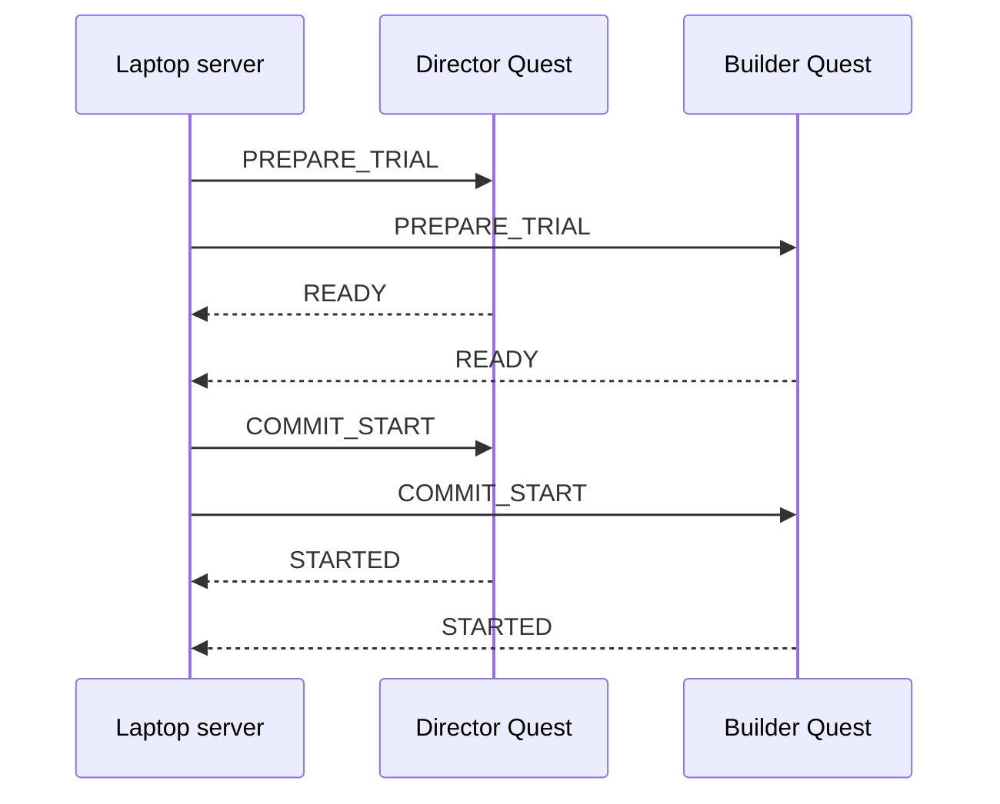

# Protocol 1.3.0

## Authority

The laptop server owns session state, trial state, state versions, and the
authoritative stopwatch. Quests are command-driven clients. A browser refresh does
not change authoritative state.

## Compatibility

Protocol versions use `major.minor.patch`.

- The current version is `1.3.0`.
- Peers with the same major version are compatible.
- A different major version is rejected before session commands are accepted.
- Enrollment also requires the exact approved Quest build ID stored in the
  session configuration.

## Enrollment and authentication

The dashboard issues a six-digit code for either temporary `QUEST_A` or
`QUEST_B`. A code is slot-specific, valid for five minutes, and consumed once.
The Quest redeems it with its stable client-instance ID, protocol version, and
app build ID.

The enrollment response contains exactly:

- `sessionId`, `deviceId`, `participantId`, and `role`;
- `accessToken` and `websocketUrl`; and
- `protocolVersion` and `approvedQuestBuildId`.

The Quest opens `websocketUrl` with `Authorization: Bearer <accessToken>`.
The token is never placed in a URL, dashboard state, event, or persisted
session record. Only a SHA-256 token hash is held in server memory. A server
restart intentionally requires re-enrollment.

## Message envelope

Every message contains:

- protocol version;
- session ID;
- nullable trial ID;
- command ID;
- state version;
- sender and target;
- UTC timestamp;
- sender-monotonic timestamp;
- message type; and
- a type-specific payload.

Access tokens are never included in message or event logs.

Protocol `1.1.0` added `HEARTBEAT_ACK`, `STATE_SNAPSHOT_APPLIED`,
`CONTINUE_AFTER_RECOVERY` / `CONTINUED`, `REQUEST_LOCAL_LOG_STATUS` /
`LOCAL_LOG_STATUS`, and `CLEANUP_LOCAL_LOG` / `LOCAL_LOG_CLEANED`.

Protocol `1.2.0` adds `BEGIN_CALIBRATION` and `CALIBRATION_REPORT`. The
laptop commands both connected Quests in the same dashboard action. Each Quest
samples for six seconds and returns only derived detections, transforms, and
quality metrics. A report must identify `tagStandard41h12`, tag IDs `1-6`, and
the locked detection-corner side length `0.0567 m`; it must explicitly declare
`rawFramesPersisted=false`.

Protocol `1.3.0` adds profile-versioned diminished-reality state control.
`PREPARE_TRIAL`, `READY`, `STARTED`, `STOPPED`, and state snapshots now carry
the requested or actual DR state. The optional researcher preview uses
`DR_PREVIEW` and `DR_STATE_REPORT`; the server exposes it only when explicitly
enabled, only in `CALIBRATION`, and never during an active trial.

## Diminished-reality lifecycle

- Both Quests require profile `PHASE6_TEST_V1` and build
  `cdr-phase6-dev-1`.
- `PREPARE` resolves the selected target against the accepted calibration but
  keeps its replacement geometry invisible.
- `SHOW` is applied only with the authoritative trial start.
- `HIDE` clears the mask at trial end, abort, or fault.
- `REVEAL` is a researcher-only pre-trial inspection state; it is not a study
  condition.
- `NO_DR` prepares no visible replacement geometry.
- Every acknowledgement reports requested state, actual state, visibility,
  calibration identity, profile version, and the provisional 72 FPS gate.
- A critical fault removes DR and returns the headset to clear passthrough.

The current pilot profiles use a white, texture-ready unlit mask. TV outer
dimensions are `1.13 x 1.075 m`, centred in the TV tag frame and offset
`-0.31 m` along its local Z axis toward the participants. Keyboard physical
dimensions are `0.29 x 0.095 m`; the approved 1 cm coverage padding produces a
final outer mask of `0.31 x 0.115 m`, centred `0.0375 m` above the desk.
Feathering is inside the final edges (`0.005 m` TV, `0.003 m` keyboard).

## Six-tag calibration

- From the seated participant view, keyboard tag `1` is on the physical left
  and tag `2` is on the physical right. Their final-room nominal centre spacing
  is `0.40 m`.
- TV tags follow the confirmed final-room placement: `4` top-left, `5`
  top-right, `6` bottom-right, and `3` bottom-left. Any three of the four may
  satisfy the redundancy requirement.
- The rig origin is the midpoint of tags `1` and `2`; `+X` points physically
  left-to-right from tag `1` to tag `2`, `+Y` is room up, and `+Z` points from
  the seated participants toward the TV.
- Threshold profile `PROVISIONAL_PHASE5_V2` reports position/rotation
  stability, keyboard-spacing residual, TV planarity, observation age, and
  cross-Quest disagreement. It conservatively removes isolated position
  outliers while preserving their rejected counts and warnings. Sustained
  position instability remains blocking; per-tag rotation RMS is diagnostic
  because the authoritative rig frames use tag-centre positions. These
  thresholds remain provisional until the physical pilot.
- The server requires the exact V2 profile in every report. This prevents an
  older V1 APK that shares the in-place `cdr-phase5-dev-3` development build ID
  from being silently accepted.
- The dashboard records each device report independently. Trial preparation is
  blocked unless both connected devices report `PASS`, or the researcher uses
  the existing reasoned manual override.
- Two physical Quest reports are compared using the rig-relative TV transform.
  A physical-plus-simulator run is labelled `DEFERRED` and is not accepted as
  evidence of two-headset compatibility.

PCA pixel buffers are transient on the headset. They are neither added to the
message payload nor written to the Quest or laptop event logs.

## Guarded start

The server does not activate the trial unless both Quests and the recording
preflight are ready.

The single practice trial follows the same guarded path using `NO_DR` with the
`KEYBOARD` distractor. It is excluded from scored analysis.

## Submission

Each Builder verbal submission produces one numbered `SUBMIT` event when the
experimenter clicks the dashboard control.

- Incorrect: log the attempt, emit the standardized `Continue` event, and keep
  the authoritative stopwatch running.
- Correct: log the attempt and request the guarded stop flow.
- Attempts must be consecutive and begin at one.
- Attempts are accepted only in `TRIAL_ACTIVE`.
- Attempts at or after the 420-second threshold remain accepted and are marked
  `afterTimeLimit=true` with their actual elapsed time.
- A correct post-limit attempt stops the trial as `TIMEOUT` and records the late
  correct completion time.
- Post-hoc overhead-video scoring remains the final verification.

## Time-limit threshold

The dashboard shows an upward stopwatch beginning at `00:00`. At 420 seconds,
the server writes one `TIME_LIMIT_REACHED` event, the dashboard shows a red
warning, and `Record late submission` remains available. Crossing the threshold
does not automatically stop the server trial.

A confirmed correct late submission freezes the stopwatch and records
`TIMEOUT`, `completedAfterTimeLimit=true`, and `lateCorrectCompletionMs`. If no
late correct submission occurs, the experimenter may instead confirm
`End trial — time limit reached`. The 420-second threshold remains the primary
task-performance limit in either path.

## Duplicate and stale commands

- The same command ID and payload returns the original result without applying
  the command again.
- Reusing a command ID with a different payload is rejected.
- A state version at or below the local version is stale and rejected.
- A state version more than one ahead is out of order and rejected.

## Reconnect

A missing heartbeat is detected after 1500 ms. The critical duration is measured
from the disconnect time or the last valid heartbeat, not from when the watchdog
event loop happens to notice it.

A critical disconnect lasting no more than 3000 ms preserves the last valid DR
state while the laptop stopwatch continues. The server sends
`STATE_SNAPSHOT` with payload `{ snapshot, snapshotHash }`. `snapshotHash` is
the SHA-256 of the nested snapshot encoded as recursively key-sorted canonical
JSON with array order preserved. The Quest must validate and apply it, then send
`STATE_SNAPSHOT_APPLIED` with the applied state version and hash.

Snapshot acknowledgement alone does not resume participant interaction. The
dashboard interlocks submissions and time-limit completion until the
experimenter confirms continuation. The server then sends
`CONTINUE_AFTER_RECOVERY` and requires a matching `CONTINUED` acknowledgement
before clearing the fault. A disconnect exceeding 3000 ms automatically ends
the active trial as `TECHNICAL_INVALID`.

## Quest backup-log lifecycle

After snapshot synchronization, the server requests `LOCAL_LOG_STATUS`. Quest
backup logs remain on-device through the session and export check. Cleanup is
never automatic: after the session reaches `SESSION_COMPLETE` and the laptop
export validates, the experimenter must explicitly request cleanup. Each Quest
must acknowledge `CLEANUP_LOCAL_LOG` with `LOCAL_LOG_CLEANED` before the
dashboard marks its backup as removed.

## Server restart recovery

A browser refresh has no effect on the authoritative server state.

When the server restarts in a non-active state, it validates and restores the
latest snapshot. If it restarts while a trial is committed, active, or stopping,
it enters `RECOVERY_REQUIRED` and does not resume the stopwatch. The experimenter
records a reason and classifies the interrupted trial as technical invalidation,
participant withdrawal, or experimenter abort. A technically invalid scored
trial is retained and linked to a reserve replacement.
