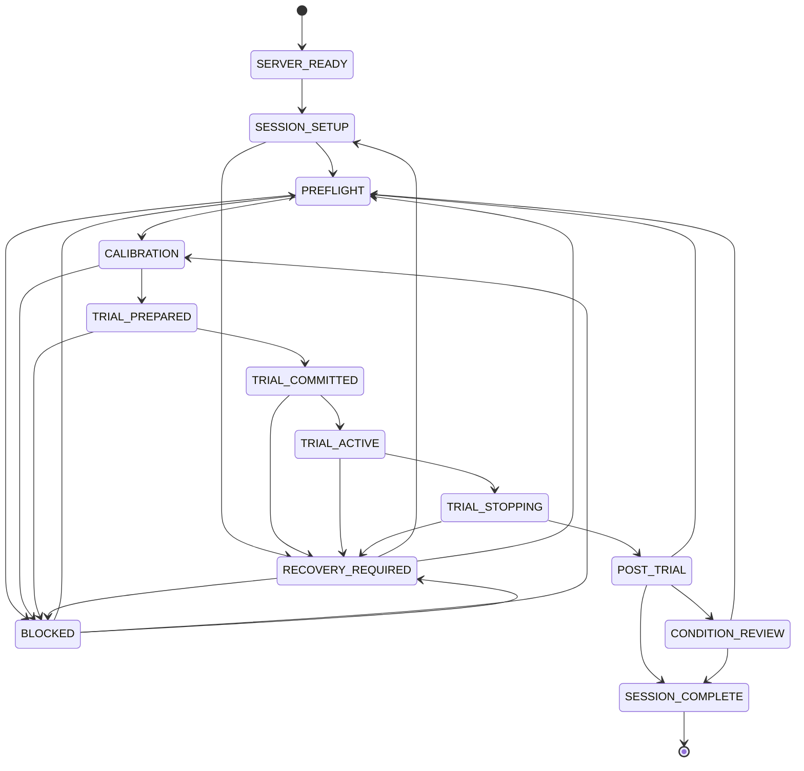
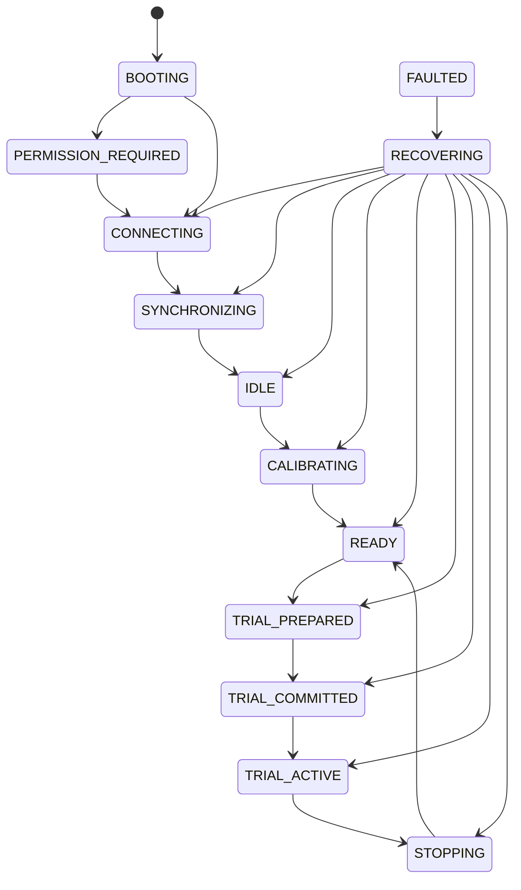

# State Machines

## Laptop

## Quest

The TypeScript transition tables are authoritative for executable behavior.
The diagrams are review aids and intentionally omit repeated fault and reconnect
arrows.
