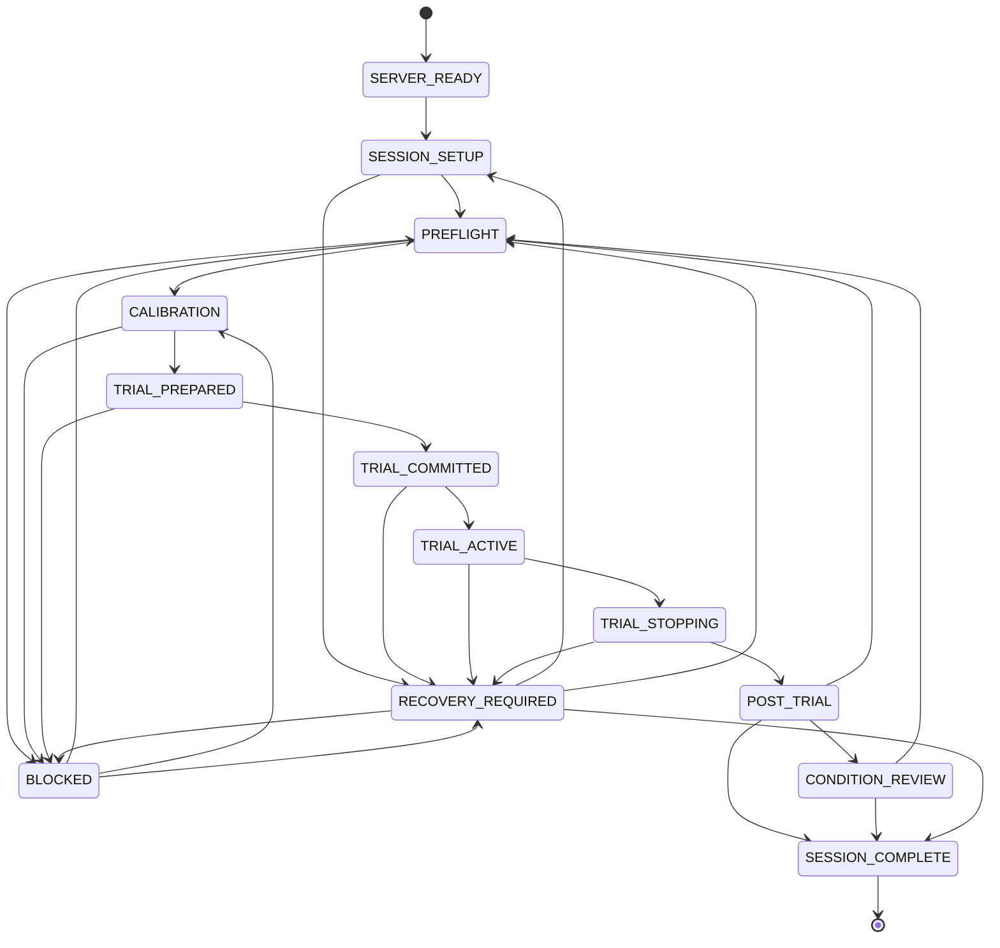
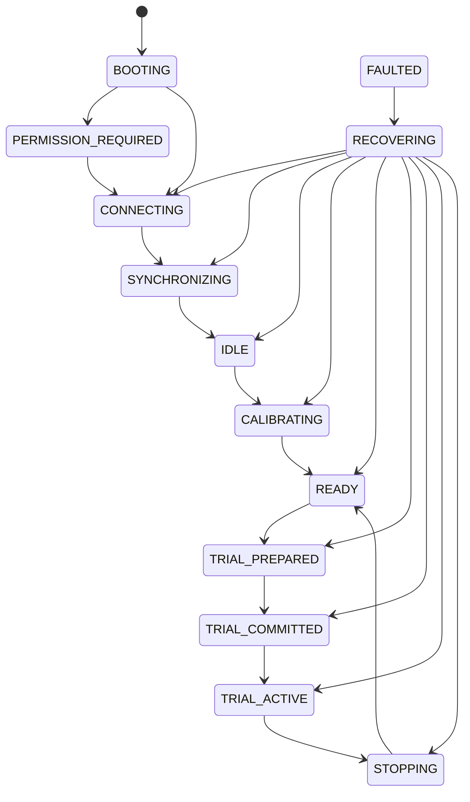

# State Machines

## Laptop

## Quest

The TypeScript transition tables are authoritative for executable behavior.
The diagrams are review aids and intentionally omit repeated fault and reconnect
arrows.

DR has a subordinate lifecycle rather than a separate participant-controlled
state machine: `HIDDEN -> PREPARED -> VISIBLE -> HIDDEN`. Researcher preview
may use `PREPARED -> REVEALED -> PREPARED/HIDDEN` only while the laptop is in
`CALIBRATION`. `NO_DR` remains non-visible throughout. Any fault transitions
the DR runtime to `FAIL_SAFE`, disables replacement geometry, and preserves
clear passthrough.

During an active-trial short reconnect, the laptop remains `TRIAL_ACTIVE` and
the stopwatch continues. The affected slot moves through the runtime-only
phases `DISCONNECTED`, `AWAITING_SNAPSHOT`, and
`AWAITING_EXPERIMENTER_CONFIRMATION`. Submission and time-limit actions remain
interlocked until a hash-validated snapshot is followed by experimenter
confirmation and a matching `CONTINUED` acknowledgement. This handshake does
not add a laptop state-machine transition.

If the critical duration exceeds 3000 ms, the laptop performs the existing
`TRIAL_ACTIVE -> TRIAL_STOPPING -> POST_TRIAL` path with outcome
`TECHNICAL_INVALID`. The Quests' authoritative target state disables DR and
requires clear-passthrough fail-safe behavior.

Reaching 420 seconds is an internal `TRIAL_ACTIVE` threshold event, not a state
transition. The state changes to `TRIAL_STOPPING` only after the experimenter
confirms a correct late submission, confirms `End trial — time limit reached`,
or selects another guarded stop outcome. A correct late submission is classified
as `TIMEOUT`.
